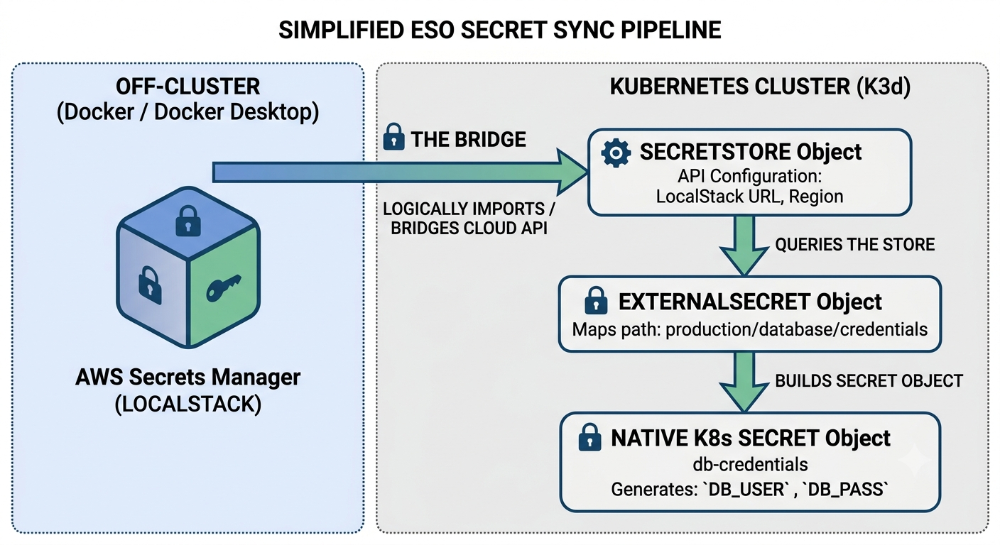

# Secret Management Isolation: ESO + AWS Secret Manager

- [Secret Management Isolation: ESO + AWS Secret Manager](#secret-management-isolation-eso--aws-secret-manager)
  - [Purpose](#purpose)
    - [Components in Scope](#components-in-scope)
    - [Operational Goal](#operational-goal)
  - [Kubernetes Objects Reference](#kubernetes-objects-reference)
    - [1. SecretStore (`localstack-backend`)](#1-secretstore-localstack-backend)
    - [2. ExternalSecret (`db-credentials-sync`)](#2-externalsecret-db-credentials-sync)
    - [3. Native Kubernetes Secret (`k8s-app-db-secret`)](#3-native-kubernetes-secret-k8s-app-db-secret)
  - [Tutorial](#tutorial)
    - [Start LocalStack](#start-localstack)
    - [Create a dummy secret inside LocalStack Secrets Manager](#create-a-dummy-secret-inside-localstack-secrets-manager)
    - [Create LocalStack Access Secret in k3d (credentials.yaml)](#create-localstack-access-secret-in-k3d-credentialsyaml)
    - [Install External Secrets Operator in k3d (helm.yaml)](#install-external-secrets-operator-in-k3d-helmyaml)
    - [Configure the ESO SecretStore (secretstore.yaml)](#configure-the-eso-secretstore-secretstoreyaml)
    - [Create the ExternalSecret](#create-the-externalsecret)
    - [Check the status of your ExternalSecret](#check-the-status-of-your-externalsecret)
    - [Verify the generated native Kubernetes secret](#verify-the-generated-native-kubernetes-secret)

## Purpose
The primary objective of this project is to simulate a production-grade cloud secret management pipeline completely offline within a local development environment. By integrating the **External Secrets Operator (ESO)** with **AWS Secret Manager** (LocalStack), we replicate how enterprise Kubernetes clusters dynamically fetch, securely inject, and automatically rotate sensitive infrastructure credentials.

### Components in Scope
* **LocalStack (AWS Secrets Manager):** Acts as our localized, mock single source of truth for cloud credentials. It eliminates the need to connect to live AWS endpoints during development, providing an identical API surface for secret retrieval.
* **External Secrets Operator (ESO):** A Kubernetes-native operator that bridges cloud APIs with internal cluster resources. Instead of developers manually managing static Kubernetes secrets, ESO continuously synchronizes data from external APIs into native cluster objects.

### Operational Goal
The definitive success metric of this configuration is to establish a 15-second synchronization loop that securely bridges the cluster boundary. The pipeline pulls mock database administrative credentials out of the isolated LocalStack container, formats them natively, and dynamically generates a functional, base64-encoded Kubernetes Secret ready for immediate application consumption.



## Kubernetes Objects Reference

### 1. SecretStore (`localstack-backend`)
The `SecretStore` serves as the **infrastructure bridge** between the Kubernetes cluster and your external secret provider. It does not hold any actual data; instead, it defines *how* and *where* the External Secrets Operator should connect to fetch your configuration.
* **Role:** API Client Configuration.
* **Key Parameters:** Defines the cloud provider backend (`aws`), the service type (`SecretsManager`), the target network endpoint (`http://host.k3d.internal:4566`), and references the authentication keys needed to connect.

### 2. ExternalSecret (`db-credentials-sync`)
The `ExternalSecret` serves as the **logical data mapper**. It acts as the instruction manual telling the operator exactly *what* data to pull out of the external provider and *how* to format it inside the cluster.
* **Role:** Data Specifier and Synchronizer.
* **Key Parameters:** Points to the target `SecretStore` to use for the connection, defines the specific path/key name of the secret inside LocalStack (`production/database/credentials`), and dictates the output structure and refresh rate (interval) of the final secret.

### 3. Native Kubernetes Secret (`k8s-app-db-secret`)
The native `Secret` is the **final functional output** generated automatically by the operator. This is a standard, built-in Kubernetes resource that applications can immediately consume.
* **Role:** Application Data Consumption.
* **Key Parameters:** Holds the actual base64-encoded key-value pairs (like `DB_USER` and `DB_PASS`). Applications running in the cluster can mount these data entries directly as environment variables or raw files without needing to know LocalStack or AWS APIs even exist.

## Tutorial
### Start LocalStack
I only select Secret Manager.
```bash
docker run -d --name localstack \
    -p 4566:4566 \
    -p 4510-4559:4510-4559 \
    -e LOCALSTACK_AUTH_TOKEN=******** \
    -e AWS_DEFAULT_REGION=us-east-1 \
    -e SERVICES=secretsmanager \
    localstack/localstack
```

### Create a dummy secret inside LocalStack Secrets Manager
These are the values to keep in mind to verify the stack in the end:
``db_admin``, ``SuperSecretPassword123``.

```bash
aws --endpoint-url=http://localhost:4566 secretsmanager create-secret \
    --name "production/database/credentials" \
    --secret-string '{"username":"db_admin","password":"SuperSecretPassword123"}' \
    --region us-east-1
```

### Create LocalStack Access Secret in k3d (credentials.yaml)
```bash
...
stringData:
  aws-access-key-id: "test"
  aws-secret-access-key: "test"
```

### Install External Secrets Operator in k3d (helm.yaml)

Inject those variables into the deployment, otherwise Secret Manager will expect a Workload Identity (and fail):
```bash
...
spec:
  interval: 1h
  values:
    extraEnv:
      - name: AWS_ENDPOINT_URL
        value: "http://host.k3d.internal:4566"
      - name: AWS_ENDPOINT_URL_SECRETSMANAGER
        value: "http://host.k3d.internal:4566"
```

Also forse CRD creation, to avoid headaches:
```bash
...
install:
    crds: CreateReplace
upgrade:
    crds: CreateReplace
```

### Configure the ESO SecretStore (secretstore.yaml)

Create SecretStore and let it authenticate against AWS Secret Manager
```bash
...
auth:
    secretRef:
        accessKeyIDSecretRef:
        name: localstack-credentials
        key: aws-access-key-id
        secretAccessKeySecretRef:
        name: localstack-credentials
        key: aws-secret-access-key
```

### Create the ExternalSecret

Set the refresh time:
```bash
...
spec:
  refreshInterval: "15s" # How often ESO checks LocalStack for updates
  secretStoreRef:
    name: localstack-backend
    kind: SecretStore
```

### Check the status of your ExternalSecret

```bash
kubectl get externalsecret db-credentials-sync

NAME                  STORE                REFRESH INTERVAL   STATUS         READY
db-credentials-sync   localstack-backend   15s                SecretSynced   True
```

### Verify the generated native Kubernetes secret

```bash
kubectl get secret k8s-app-db-secret -o jsonpath='{.data}'
{"DB_PASS":"U3VwZXJTZWNyZXRQYXNzd29yZDEyMw==","DB_USER":"ZGJfYWRtaW4="}
```

```bash
echo 'U3VwZXJTZWNyZXRQYXNzd29yZDEyMw==' | base64 -d
...
SuperSecretPassword123
```
